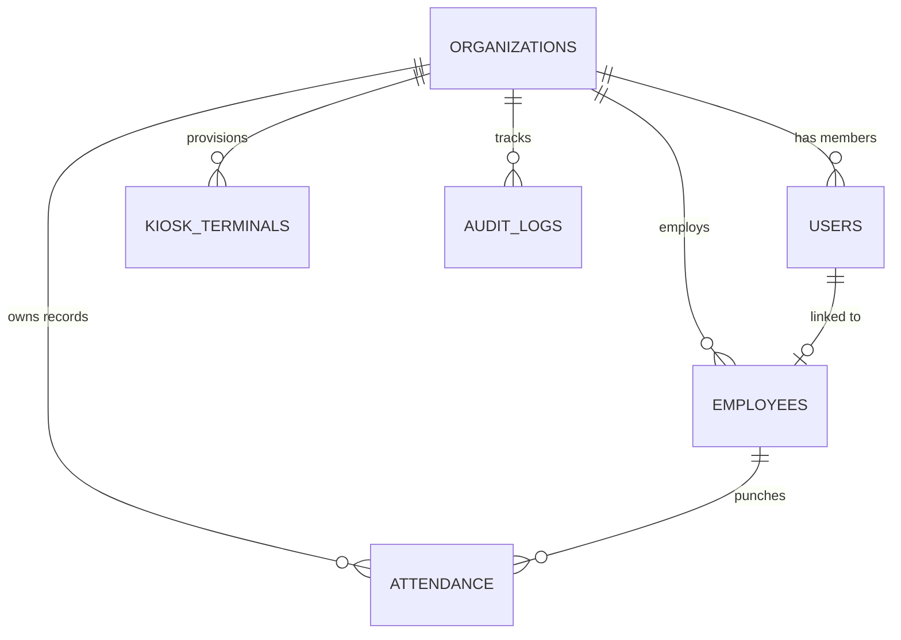

# 🗄️ Argus AI Attendance Database Architecture & Schema Documentation

This document explains the database structure, purpose of each collection, multi-tenancy design, and why specialized collections like `audit_logs` and `kiosks` exist in the architecture.

---

## 💡 Why `audit_logs` and `kiosks` Collections Are Used

### 1. `audit_logs` (Security, Compliance & Non-Repudiation)
* **GDPR / BIPA Biometric Compliance**: When dealing with biometric data (facial embeddings), data privacy laws strictly require companies to prove *who* enrolled a face, *when* consent was agreed to, and *who* modified attendance records or employee details.
* **Tamper Prevention & Accountability**: If an HR manager modifies work hours or deletes an employee, the `audit_logs` collection preserves an immutable trail containing:
  - **Actor**: Who performed the action (ID, Name, Role).
  - **Action**: What was done (e.g., `ENROLL_FACE_VECTOR`, `UPDATE_ORG_SETTINGS`, `DELETE_EMPLOYEE`).
  - **Details**: Exact before/after JSON diffs.
  - **Timestamp & IP Address**.
* **Enterprise Tenant Trust**: When selling this SaaS to other organizations, enterprise buyers demand audit trails to pass SOC2, ISO27001, and legal compliance audits.

---

### 2. `kiosks` / `kiosk_terminals` (Multi-Location Device Management)
* **Multi-Branch & Multi-Door Support**: Larger companies have multiple offices, floors, and entry gates (e.g., *New York HQ - Main Lobby*, *Chicago Branch - Floor 3 Gate*).
* **Location-Aware Tracking**: Each attendance punch records `kiosk_id`, so admins know exactly which physical terminal or office location an employee used.
* **Device Authorization & Heartbeats**: The collection tracks `last_ping` and unique terminal keys (`kiosk_key`) to ensure that only approved company tablets or kiosk hardware can submit attendance punches.

---

## 📊 Complete Database Schema Structure

The platform uses a **partitioned multi-tenant design**. Every core collection includes an indexed `organization_id` field to guarantee total data isolation between tenants.

---

### 1. `organizations` Collection
Stores tenant profile, unique subdomain/slug, and work schedule policies.

| Field Name | Type | Description |
| :--- | :--- | :--- |
| `id` | `String (UUID)` | Primary Key / Unique Tenant ID (e.g. `org-argus-101`) |
| `name` | `String` | Organization Name (e.g. *"Argus Technologies"*) |
| `slug` | `String` | Unique URL-friendly slug (e.g. `argus-tech`, indexed unique) |
| `contact_email` | `String` | Primary contact / billing email |
| `logo_url` | `String / null` | Optional branding logo |
| `work_hours.start_time` | `String` | Scheduled shift start (e.g. `"09:00"`) |
| `work_hours.end_time` | `String` | Scheduled shift end (e.g. `"18:00"`) |
| `work_hours.late_grace_minutes` | `Integer` | Grace threshold before status becomes `LATE` (e.g. `15`) |
| `work_hours.half_day_hours` | `Float` | Minimum hours required for half day (e.g. `4.5`) |
| `is_active` | `Boolean` | Tenant subscription / active status |
| `created_at` | `DateTime` | Creation timestamp |

---

### 2. `users` Collection
Stores authentication accounts with multi-tenant RBAC (`super_admin`, `org_admin`, `employee`).

| Field Name | Type | Description |
| :--- | :--- | :--- |
| `id` | `String (UUID)` | Primary Key |
| `organization_id` | `String` | Tenant ID foreign key (Indexed) |
| `name` | `String` | User full name |
| `email` | `String` | Login email (Compound indexed with `organization_id`) |
| `hashed_password` | `String` | Native Bcrypt salted password hash |
| `role` | `String` | `org_admin` or `employee` |
| `employee_id` | `String / null` | Link to `employees.id` if self-service portal user |
| `is_active` | `Boolean` | Account status |
| `created_at` | `DateTime` | Registration date |

---

### 3. `employees` Collection
Stores staff details, biometric privacy consent state, and 128-d face embedding vectors.

| Field Name | Type | Description |
| :--- | :--- | :--- |
| `id` | `String (UUID)` | Primary Key |
| `organization_id` | `String` | Tenant ID foreign key (Indexed) |
| `employee_code` | `String` | Org-specific badge/code (e.g. `ARG-001`, unique per tenant) |
| `first_name` | `String` | First Name |
| `last_name` | `String` | Last Name |
| `email` | `String` | Work email address |
| `department` | `String` | Department (e.g. *"Engineering"*, *"Sales"*) |
| `designation` | `String` | Job title |
| `phone` | `String / null` | Contact phone number |
| `consent_given` | `Boolean` | Biometric privacy acknowledgment flag |
| `consent_timestamp` | `DateTime` | Audit timestamp of consent grant |
| `face_embeddings` | `Array[Array[Float]]` | List of 128-d normalized numerical vectors (Zero raw photos stored) |
| `is_active` | `Boolean` | Active employment status |
| `created_at` | `DateTime` | Enrollment date |

---

### 4. `attendance` Collection
Stores daily punch events, calculated hours worked, status, and verification metadata.

| Field Name | Type | Description |
| :--- | :--- | :--- |
| `id` | `String (UUID)` | Primary Key |
| `organization_id` | `String` | Tenant ID foreign key (Indexed) |
| `employee_id` | `String` | Reference to `employees.id` (Indexed) |
| `employee_code` | `String` | Badge ID snapshot |
| `employee_name` | `String` | Employee Name snapshot |
| `department` | `String` | Department snapshot |
| `date` | `String` | Date string in `YYYY-MM-DD` format (Compound indexed) |
| `check_in` | `DateTime` | First face punch timestamp |
| `check_out` | `DateTime / null` | Second face punch timestamp |
| `total_hours` | `Float` | Auto-calculated duration in decimal hours (e.g. `8.25`) |
| `status` | `String` | `PRESENT`, `LATE`, `HALF_DAY`, or `ABSENT` |
| `verification_mode` | `String` | Mode (e.g. `FACE_KIOSK`) |
| `confidence_score` | `Float` | Cosine similarity match accuracy (e.g. `0.942`) |
| `liveness_verified` | `Boolean` | Anti-spoofing challenge verification flag |
| `kiosk_id` | `String / null` | Identifier of the physical tablet/kiosk used |

---

### 5. `kiosks` / `kiosk_terminals` Collection
Tracks physical terminal hardware, branch locations, and authentication keys.

| Field Name | Type | Description |
| :--- | :--- | :--- |
| `id` | `String (UUID)` | Primary Key |
| `organization_id` | `String` | Tenant ID foreign key (Indexed) |
| `name` | `String` | Kiosk display name (e.g. *"Main Entrance Lobby"*) |
| `location` | `String` | Physical site/branch (e.g. *"Building A - Ground Floor"*) |
| `kiosk_key` | `String` | Secure device API key |
| `is_active` | `Boolean` | Terminal activation switch |
| `last_ping` | `DateTime / null` | Heartbeat timestamp from kiosk device |
| `created_at` | `DateTime` | Provisioning date |

---

### 6. `audit_logs` Collection
Immutable, tamper-evident security audit trail for all admin operations.

| Field Name | Type | Description |
| :--- | :--- | :--- |
| `id` | `String (UUID)` | Primary Key |
| `organization_id` | `String` | Tenant ID foreign key (Indexed) |
| `actor_id` | `String` | User ID of the administrator |
| `actor_name` | `String` | Administrator name |
| `actor_role` | `String` | Role (`org_admin`, `super_admin`) |
| `action` | `String` | Action code (e.g. `ENROLL_FACE`, `UPDATE_SETTINGS`, `DELETE_EMP`) |
| `target_resource` | `String` | Resource type (`Employee`, `Organization`, `Attendance`) |
| `target_id` | `String / null` | ID of the modified entity |
| `details` | `Object / Dict` | JSON payload of modified attributes |
| `ip_address` | `String / null` | Client IP address |
| `timestamp` | `DateTime` | Exact UTC timestamp (Indexed) |

---

## ⚡ Database Performance & Security Indexes

To ensure sub-millisecond query responses across millions of multi-tenant records, MongoDB Atlas uses the following compound indexes:

1. **`organizations`**: `slug` (Unique)
2. **`users`**: `(organization_id, email)` (Unique)
3. **`employees`**: `(organization_id, employee_code)` (Unique), `(organization_id, is_active)`
4. **`attendance`**: `(organization_id, date, employee_id)` (Unique), `(organization_id, date)`
5. **`audit_logs`**: `(organization_id, timestamp)`
